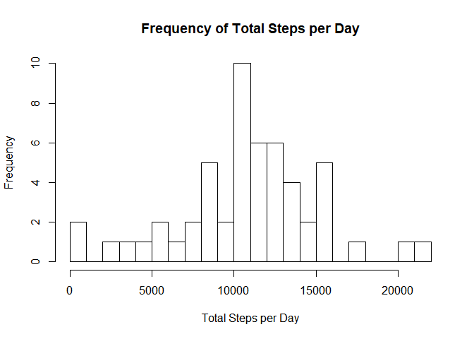
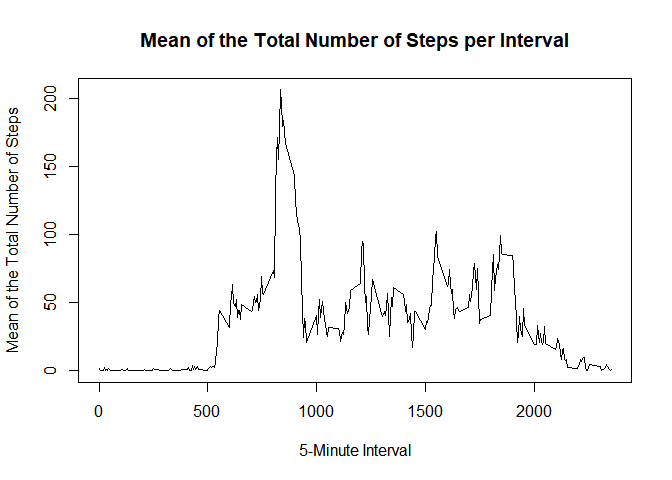
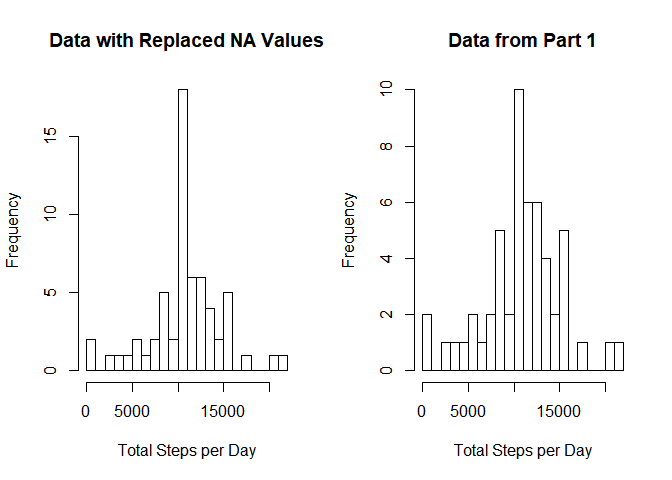
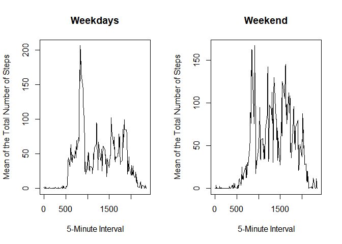

# Reproducible Research: Peer Assessment 1
Nikolai Alexander  
2017-10-15  

## Loading and preprocessing the data

Loading the data is very simple. First we need to acess the .csv file inside of 'activity.zip' We can do this by calling the unzip() function, and pulling out the csv file. We can then read the .csv file using read.csv.


```r
activity <- unzip("activity.zip", files = "activity.csv")
data <- read.csv("activity.csv")
head(data)
```

```
##   steps       date interval
## 1    NA 2012-10-01        0
## 2    NA 2012-10-01        5
## 3    NA 2012-10-01       10
## 4    NA 2012-10-01       15
## 5    NA 2012-10-01       20
## 6    NA 2012-10-01       25
```


Next, we need to remove all NA values from the *steps* column for our future analysis.

```r
data <- data[complete.cases(data),]
head(data)
```

```
##     steps       date interval
## 289     0 2012-10-02        0
## 290     0 2012-10-02        5
## 291     0 2012-10-02       10
## 292     0 2012-10-02       15
## 293     0 2012-10-02       20
## 294     0 2012-10-02       25
```

Next, we need to check the class of each piece of the data.

```r
steps <- data$steps
date <- data$date
interval <- data$interval

class(steps)
```

```
## [1] "integer"
```

```r
class(date)
```

```
## [1] "factor"
```

```r
class(interval)
```

```
## [1] "integer"
```

As we can see, 'date' is an *integer* class. We need to change it to the *Date* class.

```r
date <- as.Date(date)
class(date)
```

```
## [1] "Date"
```

There we go! Now the data is ready to be anazlysed.


## What is mean total number of steps taken per day?

To calculate the total number of steps per day, we first need to calculate the sum of all the steps for each day. (This is where removing the NA values comes in handy)

```r
tot_steps <- tapply(steps, date, sum)
print(tot_steps)
```

```
## 2012-10-02 2012-10-03 2012-10-04 2012-10-05 2012-10-06 2012-10-07 
##        126      11352      12116      13294      15420      11015 
## 2012-10-09 2012-10-10 2012-10-11 2012-10-12 2012-10-13 2012-10-14 
##      12811       9900      10304      17382      12426      15098 
## 2012-10-15 2012-10-16 2012-10-17 2012-10-18 2012-10-19 2012-10-20 
##      10139      15084      13452      10056      11829      10395 
## 2012-10-21 2012-10-22 2012-10-23 2012-10-24 2012-10-25 2012-10-26 
##       8821      13460       8918       8355       2492       6778 
## 2012-10-27 2012-10-28 2012-10-29 2012-10-30 2012-10-31 2012-11-02 
##      10119      11458       5018       9819      15414      10600 
## 2012-11-03 2012-11-05 2012-11-06 2012-11-07 2012-11-08 2012-11-11 
##      10571      10439       8334      12883       3219      12608 
## 2012-11-12 2012-11-13 2012-11-15 2012-11-16 2012-11-17 2012-11-18 
##      10765       7336         41       5441      14339      15110 
## 2012-11-19 2012-11-20 2012-11-21 2012-11-22 2012-11-23 2012-11-24 
##       8841       4472      12787      20427      21194      14478 
## 2012-11-25 2012-11-26 2012-11-27 2012-11-28 2012-11-29 
##      11834      11162      13646      10183       7047
```

Now to make a histogram to visualize our data.

```r
hist(
  tot_steps,
  breaks = 25,
  freq = TRUE,
  main = "Frequency of Total Steps per Day",
  xlab = "Total Steps per Day"
)
```

<!-- -->

I set *breaks* to 25, because I felt it gave the most accurate idea, while still being easy to read.

With this information we can now calculate the **mean** and **median** of the Total Steps Per Day

```r
mean_steps <- mean(tot_steps)
med_steps <- median(tot_steps)

print(mean_steps)
```

```
## [1] 10766.19
```

```r
print(med_steps)
```

```
## [1] 10765
```

So the **mean** of the total steps per day is **1.0766189\times 10^{4}** and the **median** of the total steps per day is **10765.** These match closely with the histogram above, making our calulations accurate.

## What is the average daily activity pattern?

For this we need to look at the amount of steps taken per 5 minute interval each day. This is a similar process to finding the number of steps per day.

```r
mean_intv <- tapply(steps, interval, mean)

head(mean_intv)
```

```
##         0         5        10        15        20        25 
## 1.7169811 0.3396226 0.1320755 0.1509434 0.0754717 2.0943396
```

There are 2355 intervals, so I did not print every value for the sake of space.

Now, to make a plot of the time over each 5 minute interval

```r
  plot(
    x = names(mean_intv),
    y = mean_intv,
    type = 'l',
    main = "Mean of the Total Number of Steps per Interval",
    xlab = "5-Minute Interval",
    ylab = "Mean of the Total Number of Steps"
  )
```

<!-- -->

The plot shows that the maximum number of steps are make somewhere between 500 and 1000 minutes. We can find this, using the max() function

```r
  max_intv <- mean_intv[which.max(mean_intv)]
  print(max_intv)
```

```
##      835 
## 206.1698
```

The **max average number of steps** is **206.1698113** at **835** minutes per day

## Imputing missing values

To see the missing values, we need to go back to the original data

```r
orig_data <- read.csv("activity.csv")

orig_steps <- orig_data$steps
orig_date <- as.Date(orig_data$date)
orig_interval <- orig_data$interval

head(orig_data)
```

```
##   steps       date interval
## 1    NA 2012-10-01        0
## 2    NA 2012-10-01        5
## 3    NA 2012-10-01       10
## 4    NA 2012-10-01       15
## 5    NA 2012-10-01       20
## 6    NA 2012-10-01       25
```

Now from here, we can count the amount of NA values in the dataset.

```r
tot_NA <- sum(is.na(orig_data))
print(tot_NA)
```

```
## [1] 2304
```

So the total number of NA values in the dataset is **2304**. If we try to look at the total number of steps for the day with these NA values, our results are going to be wrong

```r
orig_tot_steps <- tapply(orig_steps, orig_date, sum)
print(orig_tot_steps)
```

```
## 2012-10-01 2012-10-02 2012-10-03 2012-10-04 2012-10-05 2012-10-06 
##         NA        126      11352      12116      13294      15420 
## 2012-10-07 2012-10-08 2012-10-09 2012-10-10 2012-10-11 2012-10-12 
##      11015         NA      12811       9900      10304      17382 
## 2012-10-13 2012-10-14 2012-10-15 2012-10-16 2012-10-17 2012-10-18 
##      12426      15098      10139      15084      13452      10056 
## 2012-10-19 2012-10-20 2012-10-21 2012-10-22 2012-10-23 2012-10-24 
##      11829      10395       8821      13460       8918       8355 
## 2012-10-25 2012-10-26 2012-10-27 2012-10-28 2012-10-29 2012-10-30 
##       2492       6778      10119      11458       5018       9819 
## 2012-10-31 2012-11-01 2012-11-02 2012-11-03 2012-11-04 2012-11-05 
##      15414         NA      10600      10571         NA      10439 
## 2012-11-06 2012-11-07 2012-11-08 2012-11-09 2012-11-10 2012-11-11 
##       8334      12883       3219         NA         NA      12608 
## 2012-11-12 2012-11-13 2012-11-14 2012-11-15 2012-11-16 2012-11-17 
##      10765       7336         NA         41       5441      14339 
## 2012-11-18 2012-11-19 2012-11-20 2012-11-21 2012-11-22 2012-11-23 
##      15110       8841       4472      12787      20427      21194 
## 2012-11-24 2012-11-25 2012-11-26 2012-11-27 2012-11-28 2012-11-29 
##      14478      11834      11162      13646      10183       7047 
## 2012-11-30 
##         NA
```

As you can see, there are NA values for some of the dates. To take care of that, we can replace the NA's with the mean of the total steps per day.

```r
orig_tot_steps[is.na(orig_tot_steps)] <- mean_steps
print(orig_tot_steps)
```

```
## 2012-10-01 2012-10-02 2012-10-03 2012-10-04 2012-10-05 2012-10-06 
##   10766.19     126.00   11352.00   12116.00   13294.00   15420.00 
## 2012-10-07 2012-10-08 2012-10-09 2012-10-10 2012-10-11 2012-10-12 
##   11015.00   10766.19   12811.00    9900.00   10304.00   17382.00 
## 2012-10-13 2012-10-14 2012-10-15 2012-10-16 2012-10-17 2012-10-18 
##   12426.00   15098.00   10139.00   15084.00   13452.00   10056.00 
## 2012-10-19 2012-10-20 2012-10-21 2012-10-22 2012-10-23 2012-10-24 
##   11829.00   10395.00    8821.00   13460.00    8918.00    8355.00 
## 2012-10-25 2012-10-26 2012-10-27 2012-10-28 2012-10-29 2012-10-30 
##    2492.00    6778.00   10119.00   11458.00    5018.00    9819.00 
## 2012-10-31 2012-11-01 2012-11-02 2012-11-03 2012-11-04 2012-11-05 
##   15414.00   10766.19   10600.00   10571.00   10766.19   10439.00 
## 2012-11-06 2012-11-07 2012-11-08 2012-11-09 2012-11-10 2012-11-11 
##    8334.00   12883.00    3219.00   10766.19   10766.19   12608.00 
## 2012-11-12 2012-11-13 2012-11-14 2012-11-15 2012-11-16 2012-11-17 
##   10765.00    7336.00   10766.19      41.00    5441.00   14339.00 
## 2012-11-18 2012-11-19 2012-11-20 2012-11-21 2012-11-22 2012-11-23 
##   15110.00    8841.00    4472.00   12787.00   20427.00   21194.00 
## 2012-11-24 2012-11-25 2012-11-26 2012-11-27 2012-11-28 2012-11-29 
##   14478.00   11834.00   11162.00   13646.00   10183.00    7047.00 
## 2012-11-30 
##   10766.19
```

Now we have a complete data set! Let's compare with the data from the first part.

```r
par(mfrow = c(1,2))
hist(
  orig_tot_steps,
  breaks = 25,
  freq = TRUE,
  main = "Data with Replaced NA Values",
  xlab = "Total Steps per Day"
)
hist(
  tot_steps,
  breaks = 25,
  freq = TRUE,
  main = "Data from Part 1",
  xlab = "Total Steps per Day"
)
```

<!-- -->

The plots are a little different. For one, the median is a lot more frequent with the new data that from the data in part 1. However, is the mean and median different? Let's check:

```r
orig_mean <- mean(orig_tot_steps)
orig_median <- median(orig_tot_steps)
print(orig_mean)
```

```
## [1] 10766.19
```

```r
print(orig_median)
```

```
## [1] 10766.19
```

The **new mean** (1.0766189\times 10^{4}) is *exactly equal* to the **old mean** (1.0766189\times 10^{4}). However, the **new median** (1.0766189\times 10^{4}) is *slightly larger* than the **old median** (10765). In fact, the new median is equal to the old mean. This is because for all the values where there would be NA values, they are replaces with the old mean; Causing there to be more values closer to the median.

## Are there differences in activity patterns between weekdays and weekends?

To tell the difference between weekdays and weekends, we first need to convert the dates to days of the week.

```r
orig_data$date <- weekdays(orig_date)
head(orig_data)
```

```
##   steps   date interval
## 1    NA Monday        0
## 2    NA Monday        5
## 3    NA Monday       10
## 4    NA Monday       15
## 5    NA Monday       20
## 6    NA Monday       25
```

Before we do anything, we need to replace all of the NA values for each interval:

```r
orig_data[is.na(orig_data)] <- mean_intv
head(orig_data)
```

```
##       steps   date interval
## 1 1.7169811 Monday        0
## 2 0.3396226 Monday        5
## 3 0.1320755 Monday       10
## 4 0.1509434 Monday       15
## 5 0.0754717 Monday       20
## 6 2.0943396 Monday       25
```

Now we can split the data into weekdays and weekends.

```r
weekday <- orig_data[(orig_data$date != "Saturday" | orig_data$date != "Sunday"),]
weekend <- orig_data[(orig_data$date == "Saturday" | orig_data$date == "Sunday"),]
head(weekday)
```

```
##       steps   date interval
## 1 1.7169811 Monday        0
## 2 0.3396226 Monday        5
## 3 0.1320755 Monday       10
## 4 0.1509434 Monday       15
## 5 0.0754717 Monday       20
## 6 2.0943396 Monday       25
```

```r
head(weekend)
```

```
##      steps     date interval
## 1441     0 Saturday        0
## 1442     0 Saturday        5
## 1443     0 Saturday       10
## 1444     0 Saturday       15
## 1445     0 Saturday       20
## 1446     0 Saturday       25
```

Now, just like in Part 2, we need to find the mean over each 5 minute interval.

```r
mean_weekday <- tapply(weekday$steps, weekday$interval, mean)
mean_weekend <- tapply(weekend$steps, weekend$interval, mean)

head(mean_weekday)
```

```
##         0         5        10        15        20        25 
## 1.7169811 0.3396226 0.1320755 0.1509434 0.0754717 2.0943396
```

```r
head(mean_weekend)
```

```
##           0           5          10          15          20          25 
## 0.214622642 0.042452830 0.016509434 0.018867925 0.009433962 3.511792453
```

Now we can plot the 2 and compare

```r
par(mfrow=c(1,2))
plot(
  x = names(mean_weekday),
  y = mean_weekday,
  type = 'l',
  main = "Weekdays",
  xlab = "5-Minute Interval",
  ylab = "Mean of the Total Number of Steps"
)
plot(
  x = names(mean_weekend),
  y = mean_weekend,
  type = 'l',
  main = "Weekend",
  xlab = "5-Minute Interval",
  ylab = "Mean of the Total Number of Steps"
)
```

<!-- -->

There seems to be much more consistant activity during the weekend. However, during the weekday, there is a spike in activity earlier in the day. This could be due to exercise after a break at work, where during the weekend, a person has much more time to be active througout the day..
